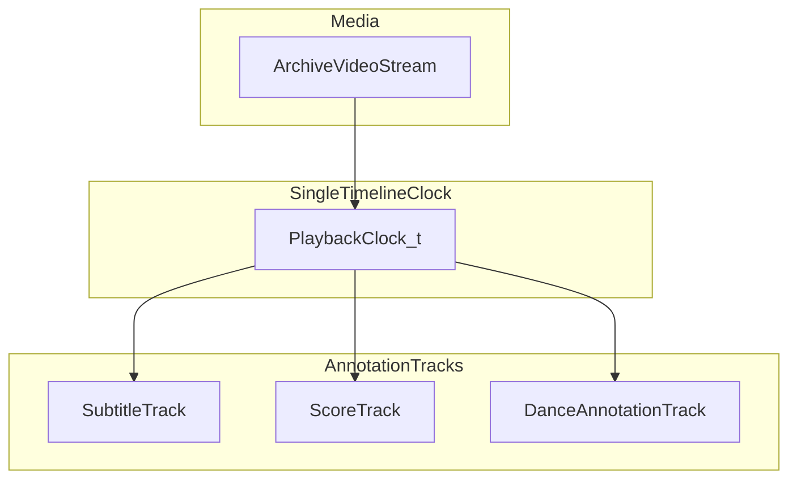

# 仕様: アーカイブ映像プレーヤーとタイムライン同期

## 文書メタデータ

| 項目 | 値 |
|------|-----|
| 親文書 | [specifications.md](../specifications.md) |
| 本書の役割 | 単一クロックに束ねる字幕・楽譜・踊り注釈、踊りガイドの段階定義、タイムラインバンドル論理例 |
| 版数 | 0.2.0 |
| 最終更新日 | 2026-04-14 |

### 変更履歴

| 版数 | 日付 | 変更内容 |
|------|------|----------|
| 0.2.0 | 2026-04-14 | 本書のスコープ外（オプション 3D 踊りビューア）を明示。親文書付録は §12 に移行 |
| 0.1.0 | 2026-04-14 | 初版。全体仕様 F-SYNC・3.5・付録の切り出し |

---

## 1. 概要

アーカイブ映像の再生位置を基準とし、字幕・楽譜・踊りのアノテーションを**同一の論理時刻 `t`** にマッピングする。永続化は DB 正規化、`timeline.json` 等のバンドル、または併用とし、実装フェーズで確定する。

## 2. 同期モデル（概念図）

親文書と同様の関係を保つ。



## 3. 要件（同期）

| 要件 ID | 説明 |
|---------|------|
| F-SYNC-01 | 全アノテーショントラックは同一 `t` を参照する |
| F-SYNC-02 | 字幕: `[start, end)` 区間とテキスト。話者ラベルは任意 |
| F-SYNC-03 | 楽譜: 区間とページ番号、または画像内オフセット（矩形スクロール） |
| F-SYNC-04 | 踊り: 区間とイベント列（例: `beat`, `stepId`, `poseHint`）。「判定」がある場合は `window` と `tolerance_ms` を定義 |
| F-SYNC-05 | オフライン展示用にタイムラインを静的ファイルとしてエクスポート可能にする余地を残す |

### 3.1 本書のスコープ外（混同防止）

次は **F-SYNC の対象外**とする。実装は別コンポーネント・別データ経路として設計する。

| 対象 | 理由 |
|------|------|
| **演者 3D＋モーション**（`optional_media_3d`） | `<model-viewer>` / Three.js 等の**教材ビューア**であり、本編の単一クロック `t` に楽譜トラックを束ねるモデルとは異なる。尺の同期は Phase 0 では**必須としない**（[optional-rich-media.md](optional-rich-media.md)） |
| **御囃子専映像**（F-DET-10） | 原則**独立した埋め込みクリップ**。本編 `TimelineBundle` への別トラック取り込みは将来検討 |
| **360° 動画・NeRF 系ビューア** | 表現種別ごとにプレーヤーが異なる（[optional-rich-media.md](optional-rich-media.md) §2〜§4） |

同一 URL の個別ページに、本編プレーヤーと 3D ビューアを**併記**してもよいが、**データモデルとテストを分離**すること。

## 4. 踊り「音ゲー」的表示の段階

| 段階 | 内容 |
|------|------|
| Phase A | 拍子線またはレーンに沿った**視覚的ガイドのみ**（スコア・ミス表示なし） |
| Phase B | キー入力またはタップで**リズム合わせ練習**（正誤表示あり、任意） |
| Phase C | 難易度・速度・ループ区間のプリセット（教育向け） |

初期実装は Phase A を必須、Phase B/C はオプションとする。

## 5. 付録: タイムラインバンドル JSON（論理例）

実装時のフィールド名は変更可。単一クロックへの束ね方のみ規約とする。

```json
{
  "media_archive_id": "uuid",
  "clock": { "unit": "second", "origin": "video_start" },
  "subtitles": [
    { "start": 12.4, "end": 18.0, "text": "口上の例文", "speaker": "大夫" }
  ],
  "score_events": [
    { "t": 12.4, "action": "show_page", "page": 2 }
  ],
  "dance_events": [
    { "t": 12.4, "type": "beat", "payload": { "bpm": 120 } },
    { "t": 13.0, "type": "step", "payload": { "id": "forward_left" } }
  ]
}
```

## 6. 関連する全体仕様

- ページ上のレイヤー表示要件: [performance-detail.md](performance-detail.md)
- メディア・トラックエンティティ: 親文書セクション 4.5、`TimelineBundle`
- 映像配信（HLS 等）: 親文書セクション 7

## 7. 実装フェーズで詰める項目（追記用）

- 3D アーカイブ映像の配信形式（親文書 Open Questions 1）
- プレーヤー実装（ネイティブ video、カスタム UI、将来 WebGL 重畳）
- 本編プレーヤーと `optional_media_3d` ビューアの**同一ページレイアウト**（タブ分割か縦積みか）
