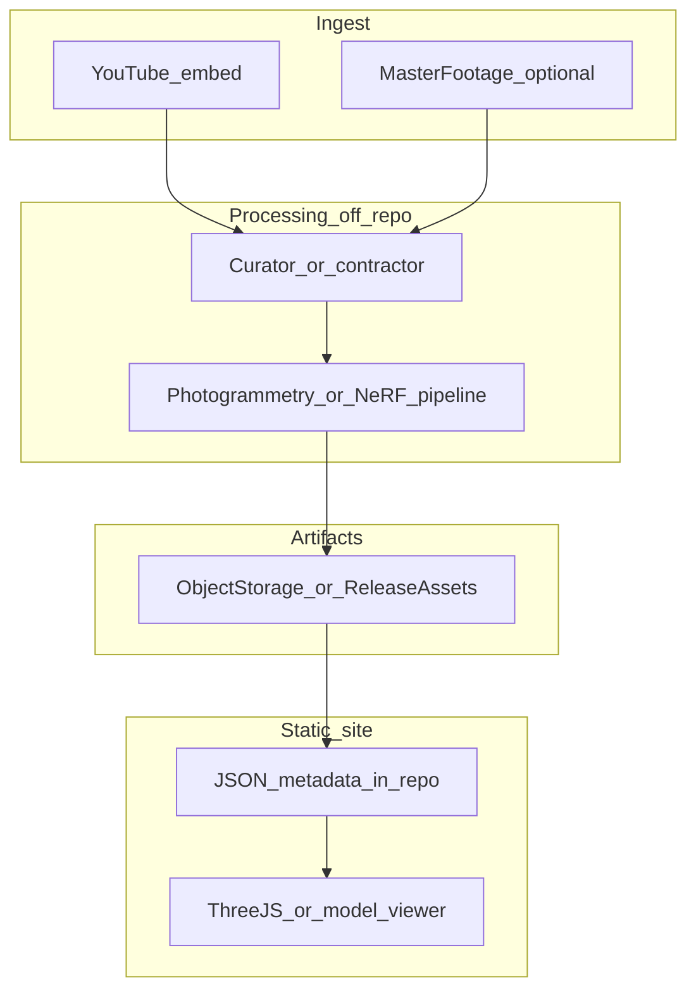

# 仕様: オプション資産（御囃子・3D 等）

## 文書メタデータ

| 項目 | 値 |
|------|------|
| 親文書 | [specifications.md](../specifications.md) |
| 本書の役割 | 御囃子楽譜・囃子専映像、演者 3D・モーション・LiDAR 小物、外部ストレージ、団体同意、**YouTube 起点の 360°／3D 教材の運用分割** |
| 版数 | 0.2.0 |
| 最終更新日 | 2026-04-14 |

### 変更履歴

| 版数 | 日付 | 変更内容 |
|------|------|----------|
| 0.2.0 | 2026-04-14 | 表現種別の用語分離、YouTube 単体入力の禁止理由、マスタ映像の分離、オフリポジトリ処理、ストレージ比較表を追加 |
| 0.1.0 | 2026-04-14 | 初版。全体仕様 F-OPT 相当の論理を定義 |

---

## 1. 要件 ID（論理）

| 要件 ID | 説明 |
|---------|------|
| F-OPT-01 | **御囃子楽譜**: 画像 URL 配列または PDF リンク。著作権クリア済みのみ |
| F-OPT-02 | **お囃子専映像**: YouTube 等の埋め込み。本編タイムライン同期は Phase 0 では任意 |
| F-OPT-03 | **演者 3D メッシュ**＋**動画由来モーション**: 外部ホスト URL、形式（glTF/glb） |
| F-OPT-04 | **LiDAR 小物**: `iphone_lidar` / `handheld_lidar` 等の採取手段メタデータ |
| F-OPT-05 | **`preservation_group_consent`**: 団体 ID または表記、`consent_scope`（列挙の部分集合）、同意記録参照 |
| F-OPT-06 | **撤回**: マニフェストから削除し、オブジェクトを削除または非公開化 |
| F-OPT-07 | **参照用 YouTube** と**加工用マスタ映像**をデータ上・運用上で分離する（本書 §2〜§4）。サーバが YouTube から動画を自動取得して再学習・再配布する流れは**採用しない**（規約・再許諾のリスク） |

## 2. 表現の種類（用語を混同しない）

実装・Issue・フォーム項目では次の区別を使う。

| 種類 | 概要 | サイト側の載せ方の例 |
|------|------|----------------------|
| **360° 動画** | equirectangular 等の全景。機材依存 | `<video>` または YouTube の 360 対応投稿の埋め込み（メッシュではない） |
| **写真測量系 3D** | 多視点静止画／動画フレームから点群・メッシュ（COLMAP 等） | **GLB** 等。Three.js / `<model-viewer>` |
| **ニューラル系**（NeRF / 3D Gaussian Splatting 等） | 学習用多視点・カバレッジが必要。成果物が大きいことが多い | 専用 Web ビューアまたは**外部ビューア URL** |

**初期方針**: 360° 動画または GLB の**手動配置**を第一とし、ニューラル系は後段とする（親文書 Open Questions 11）。

## 3. 参照メディア（YouTube）と加工用マスタの分離

### 3.1 YouTube だけを自動処理の唯一の入力にしない理由

- **利用規約・権利**: サーバが YouTube から動画を自動取得し再学習・別ホスト再配布する流れは、YouTube API／利用規約・再許諾の観点で**採用しない**。F-OPT-07 を満たす。
- **画質・視点**: 単一の YouTube 圧縮動画だけでは、写真測量や高品質スプラッツに十分な情報がないことが多い。

### 3.2 推奨する寄稿セット（フォーム／Issue の論理項目）

1. **YouTube URL**（閲覧者向け・埋め込み可のもの）
2. **加工用マスタ**（任意だが推奨）: Google Drive 等の**限定共有リンク**、または保存会が保有する原ファイルを**管理者がオフラインで受領**する手順の説明
3. **二次利用の許諾**（編集・3D 化・Web 掲載の範囲をチェックボックス等で明示）

GAS から Drive を自動取得するのは認証・スコープが重いため、**Phase 0** は「Issue にリンクを貼り、**人間がダウンロード**してリポジトリ外マシンで処理」でもよい。

## 4. 処理パイプラインの役割分担（リポジトリ外）

計算（写真測量・NeRF 等）は **GitHub Actions の無料ランナーに依存しない**。ローカル WS、大学計算機、従量課金クラウドのいずれかを「処理専用」と定義し、サイト CI とは切り離す。

成果物は **オブジェクトストレージ**（または方針次第で GitHub Release 添付）に置き、リポジトリには **URL・sha256・ライセンス ID** のみをコミットする。公開ゲートは既存の **PR＋Issue レビュー**と同一とする。

**タイムライン同期プレーヤー**（F-SYNC）との関係: 本書の 3D／360° は [archive-player-and-sync.md](archive-player-and-sync.md) §3.1 の**スコープ外**として実装を分離する。

## 5. オブジェクトストレージ候補（比較）

選定時は「無料枠・出口転送・日本からの遅延・バケットの公開読み取り可否・カスタムドメイン」を評価する。

| 候補 | 長所 | 注意 |
|------|------|------|
| **Cloudflare R2** | S3 互換、**出口転送無料**の枠組みに乗りやすい、無料枠あり | バケットをそのまま public にせず**公開用パス**（署名付き URL または CDN）の設計が必要 |
| **Backblaze B2** | ストレージ単価が安い。**Cloudflare 経由**で出口コストを抑えやすい | 直リンク運用は帯域設計を読む |
| **Wasabi** | 予測しやすい定額寄り | 最小保持期間などの制約を確認 |
| **Google Cloud Storage / Azure Blob** | 既存契約・学割等 | 出口転送が重くなりうるため **CDN 前段**を検討 |
| **GitHub Releases 添付** | 追加インフラなし | 単体サイズ・帯域・再現性に限界。**小物・試作**向け |

**推奨の初期方針**: コストと静的サイトとの相性から **R2 または B2＋Cloudflare CDN** を第一候補とし、リポジトリには **マニフェスト JSON のみ**を載せる。

## 6. データの置き場（Git とバイナリ）

- Git: メタデータ・URL・sha256・ライセンス ID・同意参照のみ
- オブジェクトストレージ: 大容量 GLB 等（上表で選定）

## 7. 関連文書

- [performance-detail.md](performance-detail.md)（F-DET-10, F-DET-11）
- [archive-player-and-sync.md](archive-player-and-sync.md)（将来のタイムライン統合・本書との非包含関係）
- [admin-operations.md](admin-operations.md)
- [crowdsourcing-and-publish.md](crowdsourcing-and-publish.md)

## 8. `optional_media_3d` の論理形（Git に残す情報の例）

キーが存在する場合のみ（省略時はキーなしでも可）。フィールド名は実装で調整してよいが、**意味の分離**は維持する。

- `performer_model`: `{ url, format: gltf|glb, sha256, license_id, source_note }`
- `dance_animation`: `{ url, format, derived_from_video_ref, retargeting_note }`
- `props`: 配列。各要素 `{ id, label_ja, scan_device: iphone_lidar|handheld_lidar, url, format, sha256, license_id }`
- `viewer`: `{ engine: threejs|model_viewer, scene_preset? }`
- **`preservation_group_consent`**（3D ブロックがある場合は必須）: `group_id` または団体名の正規表記、`consent_scope`（`performer_mesh` / `motion_from_video` / `props_lidar` の部分集合）、`consent_record`（同意書 PDF の保管先 URL、または署名済みフォーム回答 ID・日付）、`contact_verified_by`（管理者レビュー記録）等。**団体が許可した範囲外の URL はマニフェストに載せない**。撤回時は PR でブロック削除または `published: false` とし、ストレージ側の削除／アクセス遮断を [admin-operations.md](admin-operations.md) の手順に含める。

## 9. 実装フェーズで詰める項目

- 公開 read URL と署名付き URL の運用選択
- 3D ビューア（Three.js / model-viewer）の選定
- 360° プレーヤーとモバイル挙動
- Gaussian Splatting 等のフォーマット（`.ply` 等）とモバイル GPU 下限（親文書 Open Questions 11）
