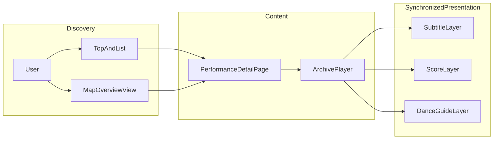
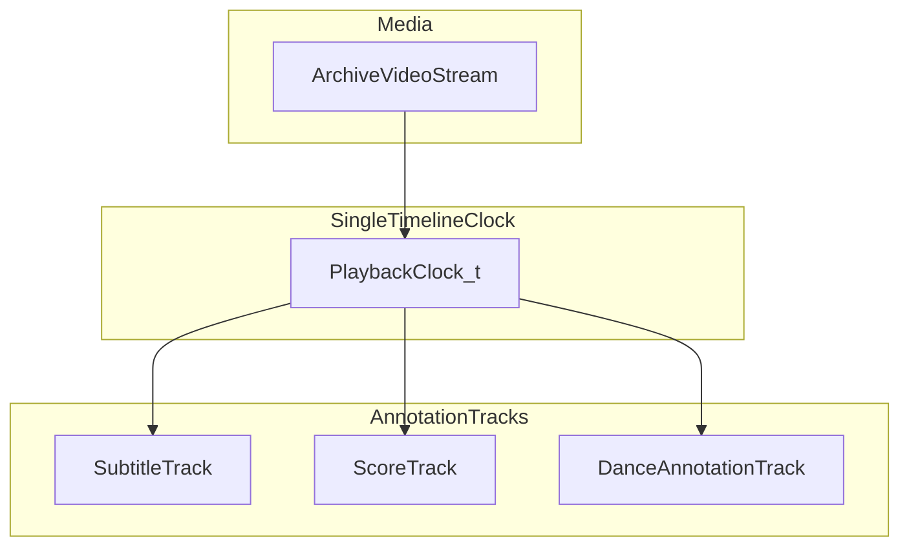

# 民俗芸能デジタルアーカイブ Webアプリ 仕様書

## 文書メタデータ

| 項目 | 値 |
|------|-----|
| ドキュメント名 | 民俗芸能デジタルアーカイブ Webアプリ 全体仕様 |
| 版数 | 0.2.5 |
| 最終更新日 | 2026-04-14 |
| 想定読者 | 研究者、実装担当、保存団体・自治体との協議参加者 |
| 文書の置き場所 | 本リポジトリの仕様書（Markdown および仕様の付属ファイル）は **`specifications/` 配下** に置く。本ファイルを全体仕様の起点とする |

### 変更履歴

| 版数 | 日付 | 変更内容 |
|------|------|----------|
| 0.2.5 | 2026-04-14 | **push 前**に `uv run pytest` と **`copilot`**（GitHub Copilot CLI）レビューを `development-with-agents.md` §5 に必須化 |
| 0.2.4 | 2026-04-14 | 開発プロセスとして **GitHub Issue 駆動**（Qiita 参照）を `development-with-agents.md` に必須化。エージェント開始時の `gh` / `git` 確認、ブランチ名への Issue 番号、`Closes #` を明文化 |
| 0.2.3 | 2026-04-14 | F-GEO（Draw 寄稿・GeoJSON 検証・カテゴリ）、F-CON-06（寄稿ブランチ命名）、F-SEARCH-03（インデックス除外）、データモデル `boundary`/`map_category`、地域集約 JSON、実装推奨順序、Open Questions 拡充、AI インタビュ段階の明文化 |
| 0.2.2 | 2026-04-14 | サブエージェント分担・Git ブランチ方針（`development-with-agents.md`）、エージェント別仕様（`agents/`）を追加 |
| 0.2.1 | 2026-04-14 | 実装ツール・モデルの固定表記を削除（実装担当はプロジェクトで任意に選ぶ） |
| 0.2.0 | 2026-04-14 | 静的公開・寄稿パイプライン・ランディング／俯瞰地図・検索・オプション資産（御囃子／3D）・情報提供者を反映。F-TOP / F-DET 拡張、技術方針を静的優先に整理 |
| 0.1.3 | 2026-04-14 | 機能別の個別仕様書（`features/`）と `README.md` を追加。索引節を新設 |
| 0.1.2 | 2026-04-14 | 保存目的を東北地域の伝統芸能とし、先行対象を岩手県とする旨を背景・目的・地理的スコープに反映 |
| 0.1.1 | 2026-04-14 | 仕様書を `specifications/` に集約する運用をメタデータに明記 |
| 0.1.0 | 2026-04-13 | 初版。全体骨子、データモデル雛形、ロードマップ、Open Questions を定義 |

### 用語集

| 用語 | 定義 |
|------|------|
| 民俗芸能 | 地域共同体に根ざし、祭礼・年中行事等に結びついて伝承される芸能。本仕様では郷土芸能・神楽・踊り等を広く含む |
| 保存団体 | 芸能の継承・公演・記録を担う任意団体・部会・同好会等 |
| 御囃子 | 太鼓・笛・鉦等による伴奏。本システムでは説明文・譜面・音声アーカイブと関連付ける |
| 口上 | 語り・祝詞・道行等の言葉によるパート。字幕・台本と同期させる対象 |
| 舞踊 | 身体表現のパート。拍・ステップ・場取り等のアノテーションと関連付ける |
| アーカイブ映像 | 3Dモデル化等の手法で再構成した記録映像。プレーヤー上で本編の基準タイムラインとなる |
| タイムライン | 映像の経過時間（またはフレーム）に対し、字幕・楽譜・踊り注釈等を束ねる単一の時系列モデル |
| content_flags | 公開サイト上の蓄積度を示す論理フラグ群（例: 個別詳細ページの有無、動画リンクの有無、3D モーションの有無）。地図マーカー色・一覧 status と整合させる |
| 情報提供者（provenance） | 各コンテンツブロックについて、寄稿者の属性（`contributor_kind`）・肩書き・寄稿日時等を記録し閲覧者に示す単位 |
| contributor_kind | 寄稿者の簡素な分類（例: 保存団体、自治体職員、一般、研究者）。詳細は個別仕様 |

### 個別仕様書索引（ステップバイステップ実装用）

機能単位で詳細を詰めるため、要件を個別ファイルに切り出した。**要件 ID の定義は本全体仕様を正とする**；個別書は実装メモや UI 詳細を追記していく。

一覧と推奨する読み・実装の目安順（ロードマップと対応しうるが、並行してよい）:

| 順（目安） | 文書 | ファイル | 主な要件 ID |
|------------|------|----------|-------------|
| 1 | ランディング・俯瞰地図 | [features/home-and-overview-map.md](features/home-and-overview-map.md) | F-TOP-01〜05 |
| 2 | 一覧・発見・検索 | [features/list-and-discovery.md](features/list-and-discovery.md) | F-LIST-01〜04、F-SEARCH-01〜03 |
| 3 | 寄稿・公開パイプライン | [features/crowdsourcing-and-publish.md](features/crowdsourcing-and-publish.md) | F-CON-01〜06 |
| 3a | 地図・GeoJSON 寄稿（Draw・カテゴリ） | [features/map-and-geojson-contribution.md](features/map-and-geojson-contribution.md) | F-GEO-01〜05 |
| 4 | Google Maps（将来オプション） | [features/google-maps.md](features/google-maps.md) | F-MAP-01〜05 |
| 5 | 個別芸能ページ | [features/performance-detail.md](features/performance-detail.md) | F-DET-01〜11 |
| 6 | オプション資産（御囃子・3D 等） | [features/optional-rich-media.md](features/optional-rich-media.md) | F-OPT-01〜07 |
| 7 | アーカイブプレーヤー・同期 | [features/archive-player-and-sync.md](features/archive-player-and-sync.md) | F-SYNC-01〜05、踊り Phase A〜C |
| 8 | 管理・運用 | [features/admin-operations.md](features/admin-operations.md) | F-ADM-01〜05 |

### サブエージェントと Git 開発

並列実装では、**担当ごとの短い仕様**と **ブランチ単位の変更**を組み合わせる。

| 文書 | ファイル | 内容 |
|------|----------|------|
| ブランチ・Issue 駆動・品質ゲート | [development-with-agents.md](development-with-agents.md) | **Issue → ブランチ → PR**（Qiita 参照）、**push 前**に `uv run pytest` と **`copilot`**、`gh` 事前確認、`main` 保護、ブランチ名に Issue 番号、`Closes #` |
| エージェント索引 | [agents/README.md](agents/README.md) | `agent-*.md` 一覧とブランチ接頭辞 |

ディレクトリ全体の説明は [README.md](README.md) を参照する。

---

## 1. 背景・目的・スコープ

### 1.1 背景

本アーカイブは、**東北地域の伝統芸能**の記録を後世に残すことを目的の一つとする。そのうえで、データ整備・公開の**当面の先行対象は岩手県**とする。

伝統芸能、とりわけ民俗芸能は口承・身体性・地域文脈に依存する。伝承者の高齢化が進み、先行対象である岩手県では少子高齢化と人口減少により、保存会の活動が細り、史料・語りが失われる自治体が増えている。東北各地でも同様の課題が指摘されうる。デジタルアーカイブは、記録の固定化と閲覧・学習への橋渡しとして有効である。

### 1.2 目的

東北地域の伝統芸能の保存に資するよう、次を達成することを目的とする（コンテンツの優先整備はまず岩手県から行う）。

1. **記録の体系化**: 来歴、保存団体の活動、御囃子・口上・舞踊の意味、台本、楽譜、インタビュー・保存資料由来の情報を、検索可能な形で蓄積する
2. **体験の補助**: アーカイブ映像再生に同期して、聞き取りにくいセリフの表示、楽譜表示、踊りのリズムゲーム的ガイドを提供し、理解と後継学習を支援する
3. **地理的文脈の提示**: **OpenFreeMap＋MapLibre GL JS**（API キー不要）を第一とし、芸能と土地・会館・祭場等の関係を可視化する。**Google Maps Platform** は運用要件に合致する場合のオプション（F-MAP）として残す

成果指標（KPI）や評価調査の設計は、本版ではプレースホルダとし、別紙または追記で定義する。

### 1.3 スコープ（含む）

- 公開向け Web 閲覧（**ランディング**、一覧、**キーワード検索**、個別芸能ページ、**俯瞰地図**）
- 映像プレーヤーと、字幕・楽譜・踊り注釈の**タイムコード同期**（本編に紐づく場合）
- **一般寄稿パイプライン**（フォーム、外部ホストへの動画・写真 URL、テキスト）と **Git 上のデータ → 静的公開（GitHub Pages 想定）** に近い運用
- **オプション**: 御囃子専用の楽譜・短い囃子動画、演者 3D＋モーション、LiDAR 小物等（エントリごとに有無が大きく異なる）
- コンテンツの論理データモデルおよび **静的配信時の責務分担**（実装詳細は実装フェーズで確定）
- 権利・クレジット・**情報提供者（provenance）の必須表示**、保存団体意向に沿ったオプション公開

### 1.4 スコープ外（初期リリース想定）

以下は初期版の対象外とする。必要に応じて後続版で取り込む。

- 現地センサ・IoT によるリアルタイム計測連携
- ライブ配信そのものの収益化プラットフォーム
- 公式の文化財指定申請ワークフロー（参考情報の掲載に留める）

### 1.5 地理的スコープ

アーカイブが扱う伝統芸能の地理的射程は**東北地域**（青森・岩手・宮城・秋田・山形・福島の各県）とする。初期データセットおよび運用上の優先整備は**岩手県を先行対象**とする。データモデル上は都道府県・市町村・任意の座標を保持でき、東北他県や域外への拡張を阻害しない。

---

## 2. 利用者とユースケース

### 2.1 利用者ペルソナ

| 利用者 | 主なニーズ |
|--------|------------|
| 研究者 | 出典付きの一次・二次情報、地名・団体名での横断検索 |
| 保存団体・伝承者 | 自団体の活動紹介、資料の正確な掲載、クレジット |
| 一般観覧者 | 写真と要約から興味を引き、映像で内容を把握 |
| 教育現場 | 授業用に安全に引用できる表示、字幕・楽譜による補助 |

### 2.2 代表ユースケース

1. ユーザーが地図上のピンまたは一覧から民俗芸能を選択する
2. 個別ページでアイキャッチ写真、来歴、保存団体、意味解説、台本・楽譜（またはダウンロードリンク）を読む
3. アーカイブ映像を再生し、**同一タイムライン**に基づき字幕・楽譜ページ・踊りガイドが追従する
4. 研究者が出典（インタビュー日、話者、文献）を確認する

### 2.3 情報アーキテクチャ（概念）



**注**: 俯瞰 UI の実装第一候補は **MapLibre＋OpenFreeMap** である。上図の `MapOverviewView` は「発見用の地図ビュー」を指し、Google 専用ではない。

---

## 3. 機能要件

### 3.0 ランディング・俯瞰地図（トップ）

| 要件 ID | 説明 |
|---------|------|
| F-TOP-01 | **ヒーロー**: 承認済み代表写真をパッチワーク状に配置した背景スライドショーと、オーバーレイ文言「民俗芸能デジタルアーカイブプロジェクト」を表示する |
| F-TOP-02 | **俯瞰地図**: 日本全体、または東北にフォーカスした日本地図をヒーロー直下に表示する（切替またはクエリで選択可能） |
| F-TOP-03 | 登録エントリを地図上に示し、**`content_flags`** に応じてマーカー色を変える（例: 個別詳細ページなし＝灰、動画等あり＝水色、3D モーションあり＝緑、詳細のみで上記なし＝第4色）。**凡例**と**色以外の区別**（アイコン・ラベル）を併用する |
| F-TOP-04 | 地域クリック時、当該地域の民俗芸能を**複数件リスト**（同一地域に複数ある場合を想定）し、各項目に**詳細ページへのリンク**、**概要**、および **status**（詳細ページ／動画／3D 等の有無）を表示する |
| F-TOP-05 | `prefers-reduced-motion` に配慮し、ヒーローアニメーションを弱めるまたは静止にフォールバックする |

### 3.1 トップページ・一覧

| 要件 ID | 説明 |
|---------|------|
| F-LIST-01 | 民俗芸能エントリの一覧を表示する（カードまたは表形式） |
| F-LIST-02 | 検索: キーワード（芸能名、地名、団体名） |
| F-LIST-03 | フィルタ: 市町村、芸能種別タグ、文化財指定の有無・区分（参考表示） |
| F-LIST-04 | 一覧から個別ページへ遷移する |

**静的公開時の検索（F-SEARCH）**: バックエンドを常時置かない構成では、ビルド時に `search_index.json` を生成し、ブラウザ上で MiniSearch / Fuse.js 等により F-LIST-02 を満たす。詳細は [list-and-discovery.md](features/list-and-discovery.md) を参照する。

| 要件 ID | 説明 |
|---------|------|
| F-SEARCH-01 | 公開データから検索インデックスを**ビルド時生成**し、同一オリジンから配信する |
| F-SEARCH-02 | 検索対象は少なくとも `name_ja`、よみ、`summary`、都道府県・市町村、タグ、保存団体名（あれば）。長文全文はフェーズ後回し可 |
| F-SEARCH-03 | **`search_index.json` に含めてはならない**: 寄稿者の**連絡先**、管理者メモ、非公開フィールド、同意書の生データ。インデックスは**公開サイトに載せる情報と同等**の範囲に制限する |

### 3.2 Google Maps 連携

**実装の位置づけ**: 本リポジトリ現行の地図は **OpenFreeMap＋MapLibre** である。F-MAP は **Google Maps を採用する場合**の要件として保持する。

| 要件 ID | 説明 |
|---------|------|
| F-MAP-01 | 芸能エントリに紐づく**複数地点**（例: 例行の祭場、保存会会館、由来に関わる史跡）をマップ上にマーカー表示する |
| F-MAP-02 | マーカーまたはリスト項目の選択で、対応する**個別芸能ページ**へ遷移する |
| F-MAP-03 | Google の利用規約・Attribution・ブランド表示要件を満たす |
| F-MAP-04 | API キーはクライアントに露出しない方針を**原則**とする（プロキシまたはサーバサイドでの地図タイル/セッション管理など、実装フェーズで方式を確定） |
| F-MAP-05 | マップが利用不能な環境では、一覧・住所テキストによるフォールバックを提供する（最低限の要件） |

**技術候補**: Maps JavaScript API、または制約を理解した上での Embed。制約差は実装時に比較表で確定する。

### 3.3 個別芸能ページ（コア）

| 要件 ID | 説明 |
|---------|------|
| F-DET-01 | **アイキャッチ**: 高解像度の代表写真、撮影者・著作権者クレジット、利用条件の表示 |
| F-DET-02 | **セクションまたはタブ**: 来歴、保存団体と活動状況、御囃子・口上・舞踊の意味、台本、楽譜、参考文献・インタビュー出典 |
| F-DET-03 | 各本文ブロックに、可能な範囲で**出典メタデータ**（日付、話者/著者、資料種別）を付す |
| F-DET-04 | **アーカイブ映像プレーヤー**: 3D 化等の映像を再生。再生位置は共通タイムラインの基準となる |
| F-DET-05 | **字幕レイヤー**: 聞き取りにくい口上・セリフを、タイム区間に応じて表示。言語切替は将来拡張 |
| F-DET-06 | **楽譜レイヤー**: 楽譜画像または SVG/PDF のページ/スクロール位置を再生時間に同期 |
| F-DET-07 | **踊りガイドレイヤー**: 拍・ステップ・小節等を「音楽ゲーム的」に提示（ノートレーン、ヒット判定 UI の有無はフェーズで切替） |
| F-DET-08 | レイヤーのオン/オフ、字幕サイズ、再生速度（一定範囲）は利用者設定として検討する |
| F-DET-09 | **情報提供者の必須表示**: ページ上の**各コンテンツブロック**（テキスト、写真、動画、楽譜、3D 等）について、`contributor_kind`・肩書き・寄稿日時等を **閲覧者が追跡できる形で必ず表示**する。管理者による公式校正は **`contributor_kind: admin`**（または同等の明示値）で区別してよい |
| F-DET-10 | **御囃子オプション（省略可）**: 御囃子用**楽譜**（画像 URL 列または PDF リンク）および**お囃子のみを主題とする短い動画**（YouTube 埋め込み等）を、セクション単位で**データがある場合のみ**表示する。本編タイムラインとの同期は Phase 0 では必須としない |
| F-DET-11 | **オプション 3D 教材**（演者モデル・動画由来モーション・LiDAR 小物）を、**保存団体等の同意範囲**に合致するときのみ表示する。資産本体 URL は Git 外のオブジェクトストレージ等を想定する |

### 3.4 寄稿・公開パイプライン（低コスト運用）

| 要件 ID | 説明 |
|---------|------|
| F-CON-01 | 一般人・関係者から **Google Form / Microsoft Forms** 等でテキスト・YouTube リンク・写真 URL・地図 GeoJSON（範囲）等を受け付ける |
| F-CON-02 | 寄稿者に **`contributor_kind`（単一選択）** と **任意の肩書き** を記入させる（保存団体／自治体職員／一般／研究者／その他） |
| F-CON-03 | フォーム送信をトリガに、**Google Apps Script 等**で GitHub API 経由の **PR および Issue 草案**を作成できるようにする（最小権限 PAT、ブランチ保護とセット） |
| F-CON-04 | サイト管理者が **PR レビュー**し、マージ後に **GitHub Pages** に反映されるパイプラインを原則とする |
| F-CON-05 | 大容量バイナリ（3D 等）はフォーム経由で Git に直コミットせず、**オブジェクトストレージ**へ配置しリポジトリにはマニフェストのみを載せる |
| F-CON-06 | フォーム連携の自動化が GitHub にコミットする場合、ブランチ名は **`contributions/<timestamp>-<slug>`** 形式を**推奨**する（`slug` はエントリまたは寄稿単位の英数字）。`main` への直接 push は行わず PR を開く |

### 3.4a 地理データと寄稿用ミニツール（境界・カテゴリ）

詳細は [map-and-geojson-contribution.md](features/map-and-geojson-contribution.md) に委ねる。要件 ID の定義は次表を正とする。

| 要件 ID | 説明 |
|---------|------|
| F-GEO-01 | 寄稿者向け**静的ページ**上で MapLibre＋**maplibre-gl-draw**（または同等）により範囲ポリゴンを描画できる |
| F-GEO-02 | GeoJSON を**クリップボード**または**ファイル**でフォームへ渡せる |
| F-GEO-03 | GAS 等が GeoJSON を**型・座標数上限**で検証してから `data/` へコミットする |
| F-GEO-04 | **`map_category`** 列挙と日本語ラベルマップ、MapLibre のデータ駆動スタイルとの対応 |
| F-GEO-05 | **`boundary` 未指定**時の暫定矩形と、**実ポリゴン**の優先順位（ポリゴンがあれば正）をデータ仕様で固定する |

### 3.5 アーカイブ映像と同期モデル

**原則**: 字幕・楽譜・踊り注釈は、**単一の論理タイムライン**（例: メディア上の `currentTime` 秒、またはフレーム番号）にマッピングする。永続化形式は **DB 正規化** または **`timeline.json` 等のバンドル** のいずれか、または併用とし、実装フェーズで確定する。



| 要件 ID | 説明 |
|---------|------|
| F-SYNC-01 | 全アノテーショントラックは同一 `t` を参照する |
| F-SYNC-02 | 字幕: `[start, end)` 区間とテキスト。話者ラベルは任意 |
| F-SYNC-03 | 楽譜: 区間とページ番号、または画像内オフセット（矩形スクロール） |
| F-SYNC-04 | 踊り: 区間とイベント列（例: `beat`, `stepId`, `poseHint`）。「判定」がある場合は `window` と `tolerance_ms` を定義 |
| F-SYNC-05 | オフライン展示用にタイムラインを静的ファイルとしてエクスポート可能にする余地を残す |

### 3.6 踊り「音ゲー」的表示の段階定義

| 段階 | 内容 |
|------|------|
| Phase A | 拍子線またはレーンに沿った**視覚的ガイドのみ**（スコア・ミス表示なし） |
| Phase B | キー入力またはタップで**リズム合わせ練習**（正誤表示あり、任意） |
| Phase C | 難易度・速度・ループ区間のプリセット（教育向け） |

初期実装は Phase A を必須、Phase B/C はオプションとする。

### 3.7 管理・運用（高レベル）

| 要件 ID | 説明 |
|---------|------|
| F-ADM-01 | コンテンツの登録・更新・公開フラグを管理する仕組みが必要（CMS 自前、Headless CMS、静的生成パイプライン等は未確定） |
| F-ADM-02 | 権利・同意（肖像、録音、楽譜複製）の記録フィールドをデータモデルに含める |
| F-ADM-03 | 公開前レビュー（ファクトチェック）ワークフローは TBD |
| F-ADM-04 | **保存団体意向**: オプション資産（3D 等）の掲載は `preservation_group_consent`（同意範囲・記録参照）に合致するときのみ許可する。撤回時はマニフェストとオブジェクトストレージの双方を更新する |
| F-ADM-05 | **provenance 検証**: PR マージ前に、各公開ブロックの `provenance` 欠落がないことを確認する |

---

## 4. コンテンツ・データモデル（論理）

以下は論理エンティティである。物理スキーマは実装時に正規化する。

### 4.1 エンティティ一覧

| エンティティ | 説明 |
|--------------|------|
| FolkPerformance | 民俗芸能の公開単位（1ページ=1エントリを基本） |
| PreservationGroup | 保存団体 |
| Location | 地図用地点（種別: 祭場、会館、史跡等） |
| Interview | インタビュー単位のメタデータ |
| InterviewSegment | 引用単位（テキスト抜粋とタイムスタンプまたはページ） |
| DocumentAsset | 台本 PDF、冊子スキャン等 |
| Score | 楽譜（ファイル群 + メタデータ） |
| MediaArchive | アーカイブ映像（エンコード種別、長さ、基準タイムラインの原点） |
| TimedSubtitle | 字幕キュー |
| DanceAnnotation | 踊りイベント列 |
| TimelineBundle | 上記トラックを束ねる論理コンテナ（JSON 名は実装で可変） |

### 4.2 FolkPerformance（必須・任意の雛形）

| フィールド | 必須 | 型（論理） | 説明 |
|------------|------|------------|------|
| id | ○ | UUID | 安定識別子 |
| slug | ○ | string | URL 用 |
| name_ja | ○ | string | 正式名 |
| name_kana | △ | string | よみ |
| summary | ○ | string | 短い要約 |
| prefecture | ○ | string | 先行整備では岩手県が多い。東北他県・域外も表現可能 |
| municipality | △ | string | 市町村 |
| tags | △ | string[] | 神楽、剣舞等 |
| eyecatch_asset_id | △ | FK | アイキャッチ画像 |
| hero_attribution | △ | string | クレジット文 |
| body_provenance | △ | rich text | 来歴本文 |
| preservation_text | △ | rich text | 保存団体・活動 |
| meaning_text | △ | rich text | 御囃子・口上・舞踊の意味 |
| references_text | △ | rich text | 参考文献一覧 |
| created_at / updated_at | ○ | datetime | 監査 |
| content_flags | △ | object | ビルド時に付与してよい。例: `has_detail_page`, `has_video`, `has_3d_motion`。地図マーカー色・地域パネルの status と一致させる |
| contributor_kind | △ | enum | 直近または主たる寄稿者の属性（F-CON-02）。表示ポリシーは個別仕様 |
| optional_hayashi | △ | object | F-DET-10。省略可。楽譜 URL 列・`hayashi_video` 等 |
| optional_media_3d | △ | object | F-DET-11。省略可。外部 URL＋`preservation_group_consent`（[optional-rich-media.md](features/optional-rich-media.md)） |
| boundary | △ | GeoJSON | 活動範囲・由来地域等の Polygon / MultiPolygon。未指定時は README 等の**暫定矩形**ロジックにフォールバックしてよい（F-GEO-05） |
| map_category | △ | enum | `kenbu` / `kagura` / `shishi_shika` / `other` 等。表示名は日本語ラベルマップ（[map-and-geojson-contribution.md](features/map-and-geojson-contribution.md)） |

各リッチブロック（本文差分・メディア追補）は、論理として **`provenance[]`**（`contributor_kind`, `contributor_title_ja?`, `submitted_at`, `source_ref?`）を子に持てる。

### 4.3 Location

| フィールド | 必須 | 説明 |
|------------|------|------|
| id | ○ | |
| folk_performance_id | ○ | 親芸能 |
| label | ○ | 地図上表示名 |
| lat, lng | ○ | WGS84 |
| location_type | △ | 祭場 / 会館 / その他 |
| source_note | △ | 座標の根拠 |

### 4.4 Interview / InterviewSegment

| フィールド | 必須 | 説明 |
|------------|------|------|
| interview.conducted_on | △ | 実施日 |
| interview.consent_ref_id | △ | 同意管理システム側 ID（TBD） |
| segment.quote | ○ | 引用テキスト |
| segment.speaker | △ | 役割または匿名 ID |
| segment.source_pointer | △ | 音声タイムコード、動画、頁 |

### 4.5 MediaArchive / TimedSubtitle / Score / DanceAnnotation

- **MediaArchive**: `duration_sec`, `uri`（ストレージキー）、`mime`, `is_primary`
- **TimedSubtitle**: `start_sec`, `end_sec`, `text`, `speaker?`
- **Score**: `pages[]` に `{ page_index, image_asset_id }`、同期は Timeline 上のイベントで参照
- **DanceAnnotation**: `events[]` に `{ t_sec, type, payload }`（`payload` は JSON）

### 4.6 静的公開時の配信（論理）

- **GitHub Pages（または同等の静的ホスト）**: HTML/CSS/JS、`places.json`、エントリ JSON、`search_index.json`、`home_slideshow_manifest.json` 等を配信する。
- **地域別集約 JSON（任意・推奨）**: 同一市町村等に複数エントリがある場合のパネル表示を軽くするため、ビルド時に `data/by_region/<prefecture>_<municipality>.json` のような**集約ファイル**を生成してもよい。クライアントが `places.json` のみから集約してもよいが、**どちらを正とするか**は実装で一貫させる（[home-and-overview-map.md](features/home-and-overview-map.md)）。
- **オブジェクトストレージ**（R2 / B2 等）: 大容量の 3D・高解像度マスタを置き、**公開 URL または署名付き URL 方針**は運用で決める。Git リポジトリには **マニフェストとチェックサム**のみをコミットする方針を推奨する。
- **開発時の FastAPI**: ローカル検証用として残してよい。本番静的化時は `fetch` 先を同一オリジンの JSON に切り替える。

---

## 5. API・フロントの責務（方針）

| 層 | 責務 |
|----|------|
| バックエンド（任意） | 開発用 API、将来の認可付き管理 API、地図キーのプロキシ（**Google Maps 採用時のみ**） |
| 静的サイト生成 / ビルド | インデックス生成、`content_flags` の計算、地域集約 JSON、HTML の束ね |
| フロント（ブラウザ） | ページ構成、MapLibre、プレーヤー、クライアント検索、タイムライン解釈 |
| CDN / オブジェクトストレージ | 映像・画像・PDF・3D の配信 |

管理用の REST 詳細は **OpenAPI で後追い** とする。公開閲覧は **GET 相当の静的ファイル**を原則とする。

---

## 6. 非機能要件

| 区分 | 要件 |
|------|------|
| アクセシビリティ | 字幕のコントラスト、フォントサイズ変更、キーボードでプレーヤー操作可能（WCAG を目標、レベルは未割当） |
| パフォーマンス | ファーストビューは LCP 重視。映像は適応ビットレート（HLS 等）を候補とする |
| セキュリティ | 管理 API は認証。公開 API は読取中心。レート制限 |
| プライバシー | インタビュー個人識別子の取り扱い方針を別文書化 |
| 可用性 | 公開サイトの SLO は未設定（追記） |

---

## 7. 技術スタック（提案・未確定箇所の明示）

| 領域 | 第一候補 | 備考 |
|------|----------|------|
| 公開ホスト | **GitHub Pages** | 運用費抑制。`docs/` または Actions アーティファクト |
| 地図（閲覧） | **OpenFreeMap＋MapLibre GL JS** | API キー不要。F-TOP / 既存 MVP と整合 |
| 地図（オプション） | Google Maps Platform | F-MAP。キー管理・課金アラート |
| 寄稿自動化 | **Google Apps Script**＋GitHub API | 代替として Power Automate 等 |
| 静的検索 | **MiniSearch** または **Fuse.js** | `search_index.json` をビルド生成 |
| バックエンド（任意） | **FastAPI** | 開発用・将来の管理 API。ユーザールールに準拠 |
| DB（将来） | PostgreSQL | 静的のみの間は不要。JSONB でタイムライン管理も可 |
| フロント | 現状はサーバテンプレート＋Vanilla JS。移行時は React/Vue 等も可 | 静的ビルドと相性の良い構成を選定 |
| 映像 | YouTube 埋め込み、HLS（.m3u8）または MP4 | 本編アーカイブのホスト先は別途 |
| 大容量 3D | **Cloudflare R2** / Backblaze B2 等 | 出口転送・コストで比較選定 |
| IaC / デプロイ | GitHub Actions（任意） | コンテナ必須ではない |

---

## 8. 外部連携・将来拡張

- **メタ調査ツール連携**: 既存の [`TraditionalPerformingArtsDigitalArchiving-MetaSurvey`](../TraditionalPerformingArtsDigitalArchiving-MetaSurvey/) 等で得た Excel/CSV を、インポートスキーマを定義した上で取り込むことを**オプション**として許容する
- **多言語 UI・字幕言語**: データモデル上 `locale` を持てるようにする
- **オフライン展示**: キオスク用にローカルキャッシュした `TimelineBundle` + 映像のセット配布を検討

---

## 9. リリース段階（ロードマップ雛形）

| Phase | 内容 |
|-------|------|
| Phase 1 | **GitHub Pages** 公開、ランディング（F-TOP）、**MapLibre 俯瞰地図**、一覧、**クライアント検索（F-SEARCH）**、個別ページ（静的）、**寄稿→PR パイプライン（F-CON）**の最小、単一映像＋字幕同期（可能な範囲） |
| Phase 2 | 楽譜同期の本格化（本編タイムライン）、踊りガイド Phase A、御囃子オプション（F-DET-10）の拡充 |
| Phase 3 | オプション 3D（F-DET-11）本格、権利・レビュー運用の詳細化、踊り Phase B/C、管理 API・Google Maps 採用の検討 |

---

## 10. Open Questions（追記用）

本節は運用・研究上の未決事項を蓄積する。行を追加してよい。

1. 3D アーカイブ映像の**配信形式**（プリレンダ動画のみか、リアルタイム 3D か）の初期方針
2. 楽譜の**著作権**クリアランスをどのプロセスで行うか
3. 伝承者・話者の**匿名化レベル**のデフォルト
4. 自治体公式サイトとの**相互リンクポリシー**
5. KPI・学習効果の**評価方法**（アンケート、アクセスログの解釈）
6. オブジェクトストレージの **公開 read と署名付き URL** のどちらを採用するか（撤回時の確実性とのトレードオフ）
7. **AI インタビュア**: **Phase 0** はフォームの自由記述＋テキスト寄稿に限定する。**Phase 1** は外部ホストのチャットボットへのリンク、または会話ログの手動貼付。**Phase 2** 以降で初めて自前のインタビュ API を検討し、**コスト上限・ログ保存・個人情報**を別途確定する
8. 検索インデックスへの **全文来歴** の取り込みタイミング（F-SEARCH-03 と両立する設計）
9. **YouTube 公開リンク**と**加工用マスタ映像**の受け渡し方法（Drive 限定共有、オフライン受領、大学サーバ等）。YouTube 単体をサーバが自動取得して再学習する流れは規約上リスクが高いため避ける方針は [optional-rich-media.md](features/optional-rich-media.md) を参照
10. 教材成果物（GLB・360° 等）の**永続 URL 方針**（CDN、カスタムドメイン、署名 URL の寿命）
11. 写真測量／Gaussian Splatting 等の**最低品質基準**とモバイル GPU の下限
12. 外部 URL **リンク切れ**のサイト上の扱い（グレーアウト表示のみか、月 1 回の Actions 軽量チェック等）
13. **`contributor_title_ja` を公開 JSON に載せる範囲**（匿名 contributor ID のみにするか、肩書きの一部マスクか）。プライバシー方針とフォーム説明文で揃える
14. **悪意ある寄稿**への緩和策の採否（URL ホワイトリスト、1 日あたり PR 数上限、初回寄稿は Issue のみ等）
15. 自治体・保存会との**別途合意**が PR だけでは不足しうるケースの扱い（面談メモ・書面の Issue 添付を必須とするか）
16. **TinySegmenter** 等の日本語トークン分割や、ビルド時のみの形態素解析を入れるか（バンドルサイズ・ビルド時間とのトレードオフ）

---

## 11. 実装推奨順序（低コスト寄稿・静的公開）

実装担当は依存関係に応じて順序を入れ替えてよいが、**誤解なく進める**ための推奨列である。

1. **静的読み込み化**: 本番相当のビルド成果物で `places.json` 等を**同一オリジン**から `fetch` する。開発時の `GET /api/places` 依存を除去またはフォールバックにする。
2. **ビルドスクリプトと Pages 有効化**: `docs/` 直置き、または Actions の `upload-pages-artifact` のいずれかで **main マージで公開**まで通す。
3. **フォーム設計と GAS プロトタイプ**: まずは `places` エントリの JSON 断片を **F-CON-06** ブランチへコミットする PR のみ。成功後に GeoJSON・YouTube 列を拡張する。
4. **地図のカテゴリフィルタ**と **F-GEO** の寄稿用 Draw ページ。
5. **ランディング＋俯瞰地図（F-TOP）**: `home_slideshow_manifest.json` → 日本／東北ビュー → 地域クリックで複数件 → 静的詳細 URL。
6. **キーワード検索（F-SEARCH）**: `search_index.json` 生成 → MiniSearch または Fuse.js の選定 → 検索ページと F-TOP からの導線。
7. **全体仕様と Google Maps 節の整理**（F-MAP はオプションとして維持）。
8. **YouTube＋将来 3D／360°**: 埋め込みとメタデータの最小統合 → 成果物ホスト方針の決定 → リポジトリ外ジョブの手順書（人間キュー可）。
9. **オプション 3D レーン**: オブジェクトストレージ設計 → `optional_media_3d` マニフェスト → 専用 Issue テンプレまたは別フォーム。
10. **御囃子オプション（F-DET-10）**: JSON の任意ブロック → 個別ページセクション → PR での著作権・団体許諾確認。

---

## 12. 付録: タイムラインバンドル JSON（論理例）

実装時のフィールド名は変更可。単一クロックへの束ね方のみ規約とする。

```json
{
  "media_archive_id": "uuid",
  "clock": { "unit": "second", "origin": "video_start" },
  "subtitles": [
    { "start": 12.4, "end": 18.0, "text": "口上の例文", "speaker": "大夫" }
  ],
  "score_events": [
    { "t": 12.4, "action": "show_page", "page": 2 }
  ],
  "dance_events": [
    { "t": 12.4, "type": "beat", "payload": { "bpm": 120 } },
    { "t": 13.0, "type": "step", "payload": { "id": "forward_left" } }
  ]
}
```

---

全体仕様および上記個別仕様の差分は、それぞれの変更履歴に記録する。章の追加・分割や個別書の新設は、ロードマップおよび**§11 実装推奨順序**とあわせて行う。
